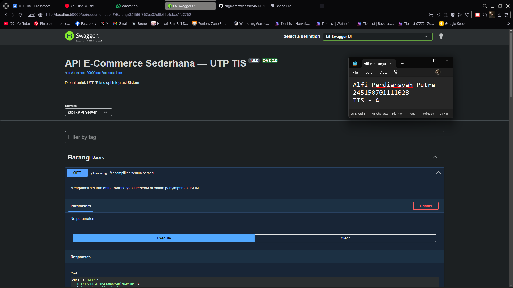

# API E-Commerce Sederhana — UTP TIS

Backend API sederhana untuk e-commerce menggunakan **Laravel 12** dengan penyimpanan **mock data JSON** (tanpa database).

| Item | Detail |
|------|--------|
| **Nama** | Alfi Perdiansyah Putra |
| **NIM** | 245150701111028 |
| **Mata Kuliah** | Teknologi Integrasi Sistem (TIS) |
| **Framework** | Laravel 12 |
| **Bahasa** | PHP 8.2+ |

---

## Cara Menjalankan

```bash
# 1. Clone repository
git clone <repository-url>
cd 245150701111028-AlfiPerdiansyahPutra-utptis

# 2. Install dependencies
composer install

# 3. Setup environment
cp .env.example .env
php artisan key:generate

# 4. Generate Swagger documentation
php artisan l5-swagger:generate

# 5. Jalankan server
php artisan serve
```

Server berjalan di `http://localhost:8000`

---

## Daftar Endpoint API

Base URL: `http://localhost:8000/api`

| Method | Endpoint | Deskripsi |
|--------|----------|-----------|
| `GET` | `/api/barang` | Menampilkan seluruh data barang |
| `GET` | `/api/barang/{id}` | Menampilkan barang berdasarkan ID |
| `POST` | `/api/barang` | Membuat data barang baru |
| `PUT` | `/api/barang/{id}` | Mengedit seluruh data barang (full update) |
| `PATCH` | `/api/barang/{id}` | Mengedit sebagian data barang (partial update) |
| `DELETE` | `/api/barang/{id}` | Menghapus data barang |

---

## Contoh Request & Response

### GET /api/barang — Menampilkan Semua Barang

```
GET http://localhost:8000/api/barang
```

Response:
```json
{
    "status": "success",
    "message": "Daftar semua barang berhasil diambil",
    "data": [
        {
            "id": 1,
            "nama": "Laptop ASUS ROG Strix",
            "harga": 18500000,
            "stok": 12,
            "kategori": "Elektronik",
            "deskripsi": "Laptop gaming high-end dengan RTX 4060"
        }
    ],
    "total": 8
}
```

### GET /api/barang/{id} — Menampilkan Barang by ID

```
GET http://localhost:8000/api/barang/1
```

Response (200):
```json
{
    "status": "success",
    "message": "Detail barang berhasil diambil",
    "data": {
        "id": 1,
        "nama": "Laptop ASUS ROG Strix",
        "harga": 18500000,
        "stok": 12,
        "kategori": "Elektronik",
        "deskripsi": "Laptop gaming high-end dengan RTX 4060"
    }
}
```

Response Error (404):
```json
{
    "status": "error",
    "message": "Barang dengan ID 99 tidak ditemukan"
}
```

### POST /api/barang — Membuat Barang Baru

```
POST http://localhost:8000/api/barang
Content-Type: application/json
```

Body:
```json
{
    "nama": "Mousepad Gaming XL",
    "harga": 150000,
    "stok": 50,
    "kategori": "Aksesoris",
    "deskripsi": "Mousepad gaming ukuran XL anti-slip"
}
```

Response (201):
```json
{
    "status": "success",
    "message": "Barang berhasil ditambahkan",
    "data": {
        "id": 9,
        "nama": "Mousepad Gaming XL",
        "harga": 150000,
        "stok": 50,
        "kategori": "Aksesoris",
        "deskripsi": "Mousepad gaming ukuran XL anti-slip"
    }
}
```

### PUT /api/barang/{id} — Full Update

```
PUT http://localhost:8000/api/barang/1
Content-Type: application/json
```

Body (semua field wajib):
```json
{
    "nama": "Laptop ASUS ROG Strix G16",
    "harga": 19500000,
    "stok": 15,
    "kategori": "Elektronik",
    "deskripsi": "Laptop gaming versi terbaru"
}
```

### PATCH /api/barang/{id} — Partial Update

```
PATCH http://localhost:8000/api/barang/2
Content-Type: application/json
```

Body (minimal satu field):
```json
{
    "harga": 950000
}
```

### DELETE /api/barang/{id} — Hapus Barang

```
DELETE http://localhost:8000/api/barang/1
```

Response (200):
```json
{
    "status": "success",
    "message": "Barang dengan ID 1 berhasil dihapus",
    "data": {
        "id": 1,
        "nama": "Laptop ASUS ROG Strix",
        "harga": 18500000,
        "stok": 12,
        "kategori": "Elektronik",
        "deskripsi": "Laptop gaming high-end dengan RTX 4060"
    }
}
```

---

## Validation & Error Handling

| HTTP Code | Deskripsi |
|-----------|-----------|
| `200` | Request berhasil |
| `201` | Resource berhasil dibuat |
| `404` | Resource tidak ditemukan |
| `422` | Validasi gagal |

Format response konsisten:
```json
// Sukses
{ "status": "success", "message": "...", "data": { } }

// Error
{ "status": "error", "message": "...", "errors": { } }
```

---

## Dokumentasi Swagger

Swagger UI dapat diakses di: `http://localhost:8000/api/documentation`



---

## Struktur Project

```
245150701111028-AlfiPerdiansyahPutra-utptis/
├── app/Http/Controllers/
│   └── BarangController.php        # Controller CRUD + Swagger annotations
├── bootstrap/
│   └── app.php                     # Registrasi route API
├── routes/
│   └── api.php                     # Definisi endpoint API
├── storage/data/
│   └── barang.json                 # Mock data JSON (non-database)
├── docs/
│   └── swagger-ui.png              # Screenshot Swagger UI
├── API_DOCUMENTATION.md            # Dokumentasi API lengkap
└── README.md                       # File ini
```
